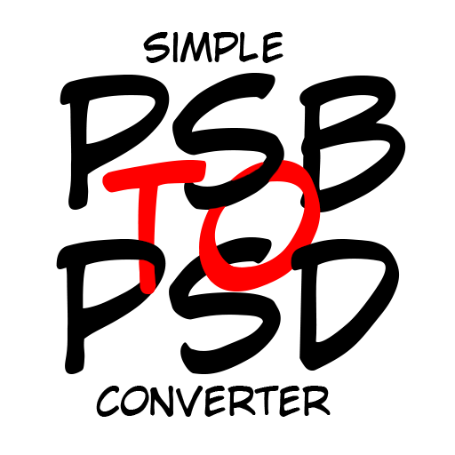

# just a Simple PSB to PSD Converter

A lightweight, drag-and-drop utility designed to save your RAM and your sanity. 
for those who need it.

 ## 📖 The Story
Working with massive `.psb` files full of heavy layers—whether for long-strip typesetting, massive illustrations, or complex design canvases—can be exhausting. Opening and converting them to `.psd` one by one manually is a tedious chore. 

This tool was born to take over that repetitive task. You drop the files, go grab a coffee, and let it do the heavy lifting in the background.

## Features
* **Drag & Drop Interface:** Toss in individual `.psb` files or throw an entire folder at it. It will sniff out the right files automatically.
* **Sequential Processing:** It commands your Photoshop to process the files one by one. No more RAM crashes from opening 20 massive files at once.
* **Standalone Executable:** No Python installation required. Just download, double-click, and use.
* **Dark Minimalist UI:** Easy on the eyes, keeping your workspace aesthetic clean.

## How to Use (For Regular Users)
1. Go to the **Releases** section on the right side of this page.
2. Download the `converter.exe` file.
3. Make sure you have **Adobe Photoshop** installed on your system (the tool uses it as the engine).
4. Double-click the `.exe` file.
5. Drag and drop your `.psb` files or folders into the dark window.
6. Wait for the magic to happen!

## 🛠️ How to Build (For Developers)
If you want to tinker with the engine yourself, you're more than welcome.

1. Clone this repository:
````
   git clone [https://github.com/yourusername/psb-to-psd-converter.git](https://github.com/yourusername/psb-to-psd-converter.git)
````
2.  Install the required dependencies:
````
    pip install pywin32 tkinterdnd2 Pillow
````
3.  Run the script directly:
````
    python converter.py
````
4.  To compile it into an `.exe` with the custom icon, use PyInstaller:
````
    pyinstaller --noconsole --onefile --icon=app_icon.ico converter.py
````

## 🤝 Contributing

Feel free to fork this project, submit pull requests, or drop an issue if you find a bug. Let's make life easier for fellow creators.

## 📄 License

[MIT License](https://www.google.com/search?q=LICENSE) - Do whatever you want with it, just keep the creative spirit alive.
